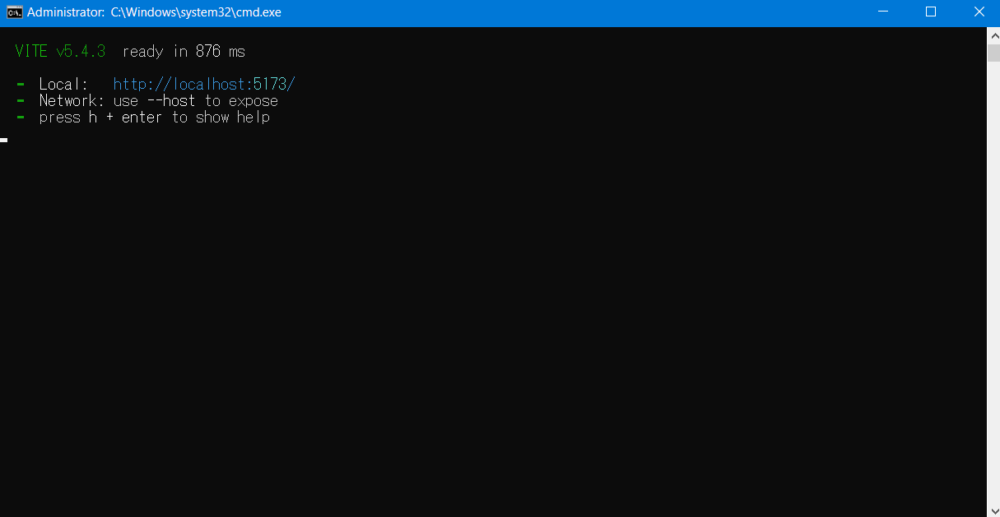
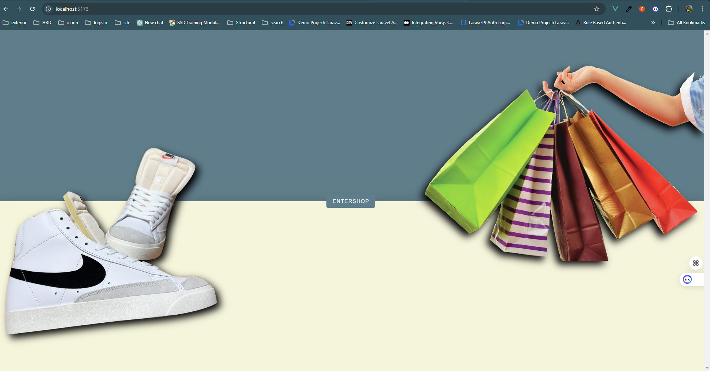
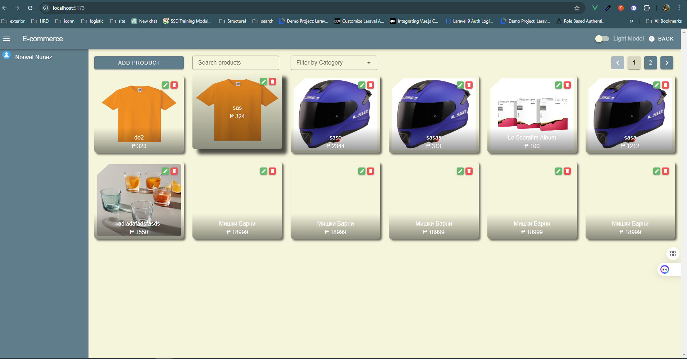

# Vue 3 + Vite + Vuetify

## Installation

1. Clone the repository:
    ```bash
   git clone <repository_url>
   cd project-directory
   npm install or yarn install

- npm run dev or yarn dev
- 

## OUTPUT
- Landing Page
- 

- Main Page
- 

## Additional Information
- **Vue 3 Documentation:** [https://v3.vuejs.org/guide/introduction.html](https://v3.vuejs.org/guide/introduction.html)
- **Vite Documentation:** [https://inertiajs.com/](https://vitejs.dev/)
- **Vuetify Documentation:** [https://inertiajs.com/](https://vuetifyjs.com/en/)

